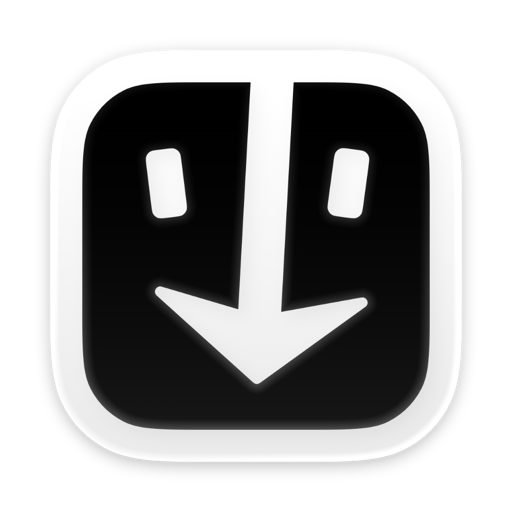
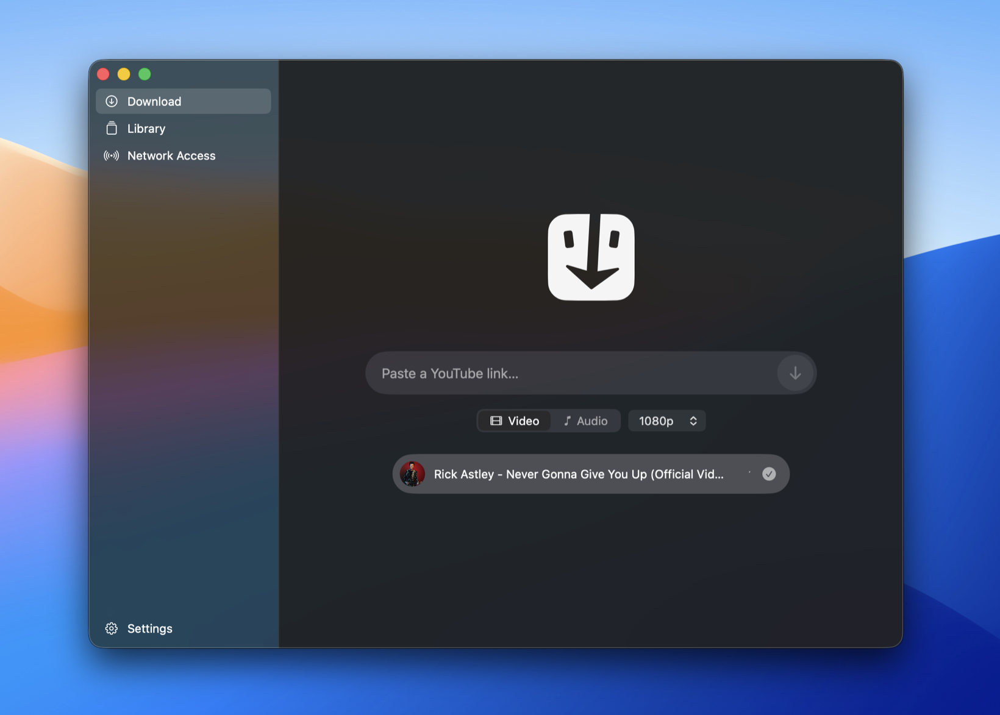
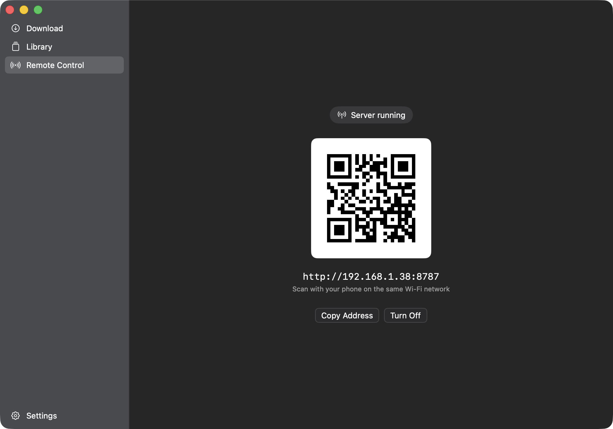
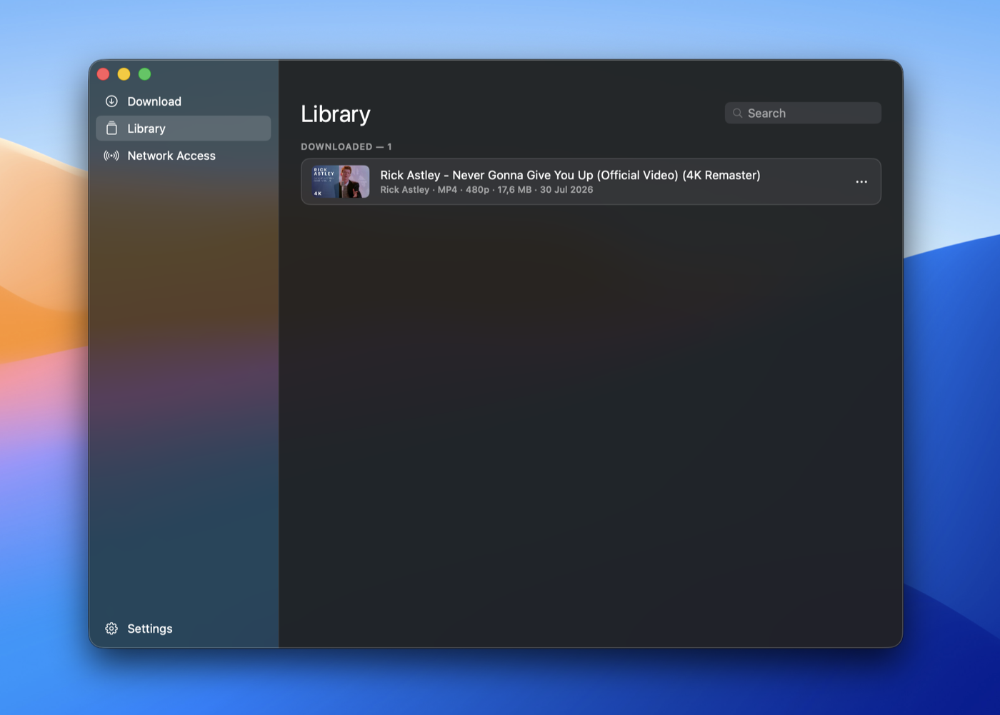

<div align="center">



# TBD — To be downloaded

**Paste a link. Get the file.**

A native macOS downloader built on yt-dlp — that your phone can drive too.

[](#system-requirements)
[](#system-requirements)
[](#how-it-works)
[](https://github.com/yt-dlp/yt-dlp)
[](#first-launch)
[](LICENSE)

<!-- Enable once the repository is public and the first release is published:
[](https://github.com/eliorpom-cmd/to-be-downloaded/releases/latest)
[](https://github.com/eliorpom-cmd/to-be-downloaded/releases)
[](https://github.com/eliorpom-cmd/to-be-downloaded/stargazers)
-->

<!-- SCREENSHOT TO TAKE — hero.png: entire window, Download screen, light theme,
     one download in progress (capsule at ~60%) + one finished. Window separated
     from background (⌘⇧4 then Space on window, shadow preserved). -->


</div>

---

## What is TBD?

yt-dlp is the best downloader there is, and it is a command line. TBD is a small
native Mac app wrapped around it: one field, one button, files in `~/Downloads`.

It also runs a tiny web server on your Wi-Fi. Scan the QR code with your phone,
paste a link there, and your **Mac** does the downloading — then you pull the
finished file to the phone if you want it. Nothing to install on the phone.

No account, no telemetry, no ads, no subscription. Monochrome on purpose.

## Highlights

### One field, and it already knows what you copied

Paste and press return. If a video link is sitting in your clipboard, the field
says so and offers it in one click. The thumbnail and title appear in about
200 ms — before yt-dlp has even finished looking at the page.

<!-- SCREENSHOT TO TAKE — clipboard.png: URL field with clipboard icon visible,
     light theme, close-up of field (not entire window). -->


### A progress bar that means something

yt-dlp downloads the video stream 0→100 %, then the audio stream 0→100 %, then
muxes. Most front-ends show you that raw and the bar bounces. TBD weighs the
phases into **one bar that only ever goes forward**, with a countdown that
doesn't jitter — and the bar *is* the row, filling the capsule as it goes.

<!-- SCREENSHOT TO TAKE — progress.png: two or three stacked capsules, one in
     progress (~40%), one in "Merging", one done. Dark theme preferred, shows
     filling better. -->


### Your phone drives, your Mac works

Open **Network Access**, scan the QR code, and the same engine is reachable from
any device on the same Wi-Fi — phone, tablet, someone else's laptop. The web UI
is the same design as the app, installable as a PWA, and it can hand you the
finished file over HTTP.

<!-- SCREENSHOT TO TAKE — network.png: Network Access screen with QR code.
     Ideally next to it, a screenshot of the web page on iPhone (docs/assets/webui.png). -->


### It behaves like a Mac app

Drag a finished file into the Finder. Hit space for Quick Look. Watch the Dock
icon fill up. Hit ⌥⌘V from anywhere to download whatever is in your clipboard.
Right-click a link in Safari → **Services** → *Download with TBD*.

<!-- SCREENSHOT TO TAKE — library.png: Library screen with a few entries and
     their thumbnails. Bonus: menubar.png, menu bar item menu open. -->


## Everything else

**Formats**
- MP4 video with quality selection, H.264 preferred so QuickTime can actually
  play it (YouTube serves AV1 that most Macs can't decode).
- Audio as **M4A**, remuxed without re-encoding — MP3 if you'd rather.
- Subtitles embedded as a track, when the video has them.

**Downloading**
- **Queue** — two at a time by default, the rest wait.
- **Playlists** — a playlist link opens a picker: all of it, a selection, or just
  the one video the link pointed at.
- **Estimated size** before you start, and a warning if it's already in your
  library.
- **Resume** — quit mid-download, come back, it picks up where it stopped.
- Pause and resume any job.

**Living with it**
- **Library** that survives restarts, with thumbnails, reveal in Finder, and
  "download again".
- Filename patterns (title, channel, date, or your own yt-dlp template).
- Light, dark, or system. Menu bar item. Notifications you can click.
- **Self-updating**: the app, yt-dlp and FFmpeg each check once a day. yt-dlp
  matters more than it sounds — YouTube changes its defenses constantly, and a
  frozen yt-dlp goes stale on its own.

## Install

### Homebrew (recommended, once a release exists)

```bash
brew install --cask --no-quarantine eliorpom-cmd/tap/to-be-downloaded
```

`--no-quarantine` is **required**. The app is ad-hoc signed, not notarized by
Apple (notarization needs a paid Apple Developer account). Without the flag,
macOS quarantines the bundle and refuses to open it. The flag affects this app
only and disables nothing else.

### Manually

Drag `TBD.app` into `/Applications` and launch it. On a Mac other than the one
that built it, the first launch needs one of:

- **right-click** the app → **Open** → **Open**, or
- `xattr -dr com.apple.quarantine "/Applications/TBD - To be downloaded.app"`

### From source

```bash
brew install xcodegen
./scripts/install.sh     # build + install into /Applications
```

See [docs/BUILDING.md](docs/BUILDING.md) for the full build story.

## System requirements

| | |
| --- | --- |
| **macOS** | 13 Ventura or later |
| **Chip** | Apple Silicon (arm64) — no Intel build |
| **Disk** | ~43 MB for the app, ~56 MB more once FFmpeg is fetched |
| **Network** | Needed once on first launch (FFmpeg), then only to download |
| **Account** | None. Ever. |

## First launch

The app downloads **FFmpeg** once (~56 MB) before the first download can run,
and says so on screen while it does. It comes from
[ffmpeg.martin-riedl.de](https://ffmpeg.martin-riedl.de), is checked against the
published SHA-256, and must carry a valid Apple **Developer ID** signature from
that publisher — otherwise it is thrown away rather than installed.

Why it isn't simply bundled: the static build this project used to ship was
compiled `--enable-nonfree`, which makes it **not legally redistributable** by
anyone, under any license. Fetching it from the party who *is* allowed to
distribute it fixes that, and takes the app from 125 MB to 43 MB.
[docs/THIRD-PARTY.md](docs/THIRD-PARTY.md#ffmpeg-is-downloaded-not-bundled)
has the full reasoning.

## Usage

1. Paste a link, pick **Video** or **Audio** plus a quality, click the arrow.
   Files land in `~/Downloads`.
2. A **playlist** link opens a sheet: take everything, a selection, or only the
   video the link targeted.
3. To drive it **from your phone** (same Wi-Fi): scan the QR code shown in the
   app, or open `http://<mac-ip>:8787`.
   - macOS may ask to **allow incoming connections** → Allow.

## How it works

SwiftUI app → `DownloadEngine` spawns `yt-dlp` as a subprocess (never a shell)
and parses its JSON progress → the same engine backs both the native UI and the
LAN HTTP server, so there is no duplicated logic and no second source of truth.

- **UI**: SwiftUI, macOS 13 target, monochrome design system in `Theme.swift`.
- **Server**: [FlyingFox](https://github.com/swhitty/FlyingFox), statically
  linked — no framework in the bundle.
- **Engine**: `yt-dlp` bundled as a seed, then self-updated into
  `~/Library/Application Support/TBD/bin`. FFmpeg lives next to it.
- **Project file**: generated by XcodeGen from `project.yml`, which is the
  source of truth — `.xcodeproj` is gitignored.

[docs/ARCHITECTURE.md](docs/ARCHITECTURE.md) goes further.

## Documentation

| Document | What's in it |
| --- | --- |
| [docs/ARCHITECTURE.md](docs/ARCHITECTURE.md) | Layout, the download engine, the LAN server, the naming scheme |
| [docs/BUILDING.md](docs/BUILDING.md) | Building, installing from source, refreshing the bundled yt-dlp |
| [docs/UPDATES.md](docs/UPDATES.md) | How the app and yt-dlp update themselves, and the security model behind it |
| [docs/RELEASING.md](docs/RELEASING.md) | Cutting a release, signing keys, the Homebrew tap, key loss |
| [docs/TROUBLESHOOTING.md](docs/TROUBLESHOOTING.md) | Stale Spotlight results, quarantine, TLS interception, inactive Share extension |
| [docs/THIRD-PARTY.md](docs/THIRD-PARTY.md) | Bundled and downloaded components, their licenses, and why FFmpeg is not shipped |
| [CONTRIBUTING.md](CONTRIBUTING.md) | How to propose a change |
| [SECURITY.md](SECURITY.md) | Reporting a vulnerability |
| [CHANGELOG.md](CHANGELOG.md) | Notable changes per version |

## Legal

TBD is a front-end for yt-dlp. It downloads what you point it at; what you are
allowed to point it at is between you, the site's terms of service, and your
local copyright law. Downloading material you do not have the right to copy is
your responsibility, not the app's.

## License

**[AGPL-3.0](LICENSE)** for this project's own source. In plain terms:

- **Fork it, change it, use it** — for anything, including at work. No permission
  needed.
- **Ship your fork and you ship your source too**, under the same license. Same
  if you run a modified version as a network service.
- **Credit stays legible** — keep the [NOTICE](NOTICE) file, and name the
  original in your own about screen.
- **The icon isn't yours to reuse.** It is the author's own work, licensed to
  this app only; a fork ships its own.

That combination is deliberate: it keeps TBD free and forkable, while making a
closed paid clone of it impossible. Nothing stops you charging for a fork — you
just have to hand your users the source, which is usually the end of that idea.

Copyright stays with the author, so other arrangements are possible: if the AGPL
doesn't fit your use, ask (eliorpom@gmail.com, subject `[TBD licensing]`).

Bundled and downloaded third-party components keep their own licenses — see
[docs/THIRD-PARTY.md](docs/THIRD-PARTY.md).

## Credits

Built by [Elior Pommier](https://byelior.com).

- **App icon** by **Saint**, aka *System Settings* —
  [@app_settings](https://x.com/app_settings). The app would have no face
  without him.
- **[yt-dlp](https://github.com/yt-dlp/yt-dlp)** does the actual downloading.
  TBD is a face on top of it.
- **[FFmpeg](https://ffmpeg.org)** joins the streams, extracts the audio and
  embeds the subtitles.
- **[FlyingFox](https://github.com/swhitty/FlyingFox)** serves the web UI on your
  Wi-Fi.

The same credits live inside the app, in **Settings → Credits**.

<div align="center">

If it saves you time — [buy me a coffee ☕](https://ko-fi.com/eliorpom)

</div>
